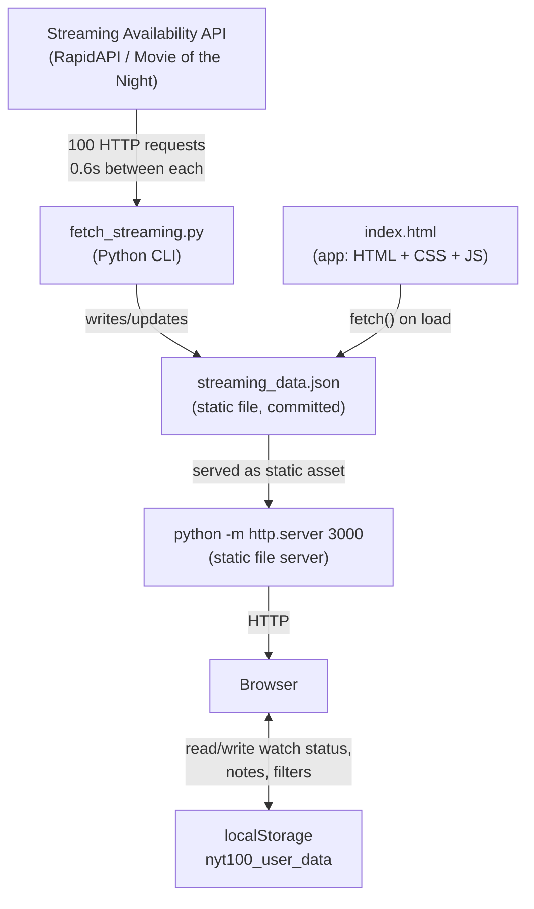
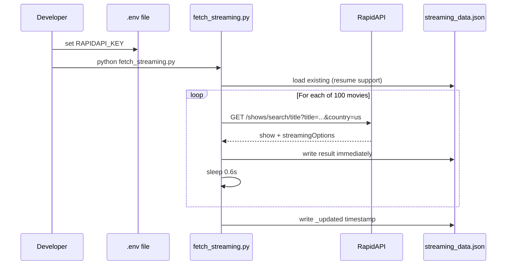
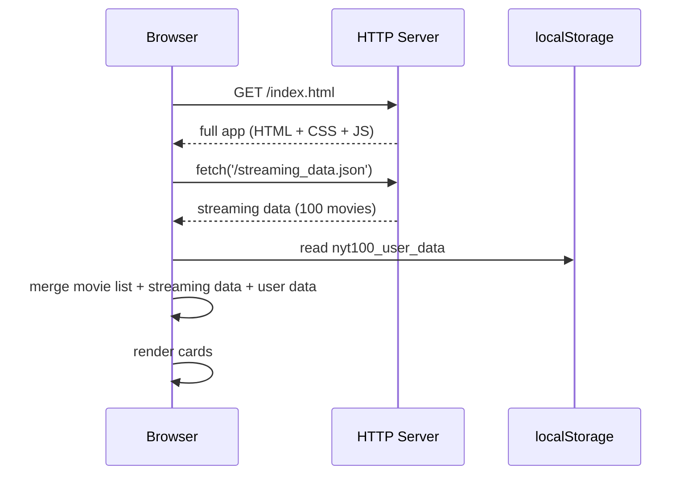
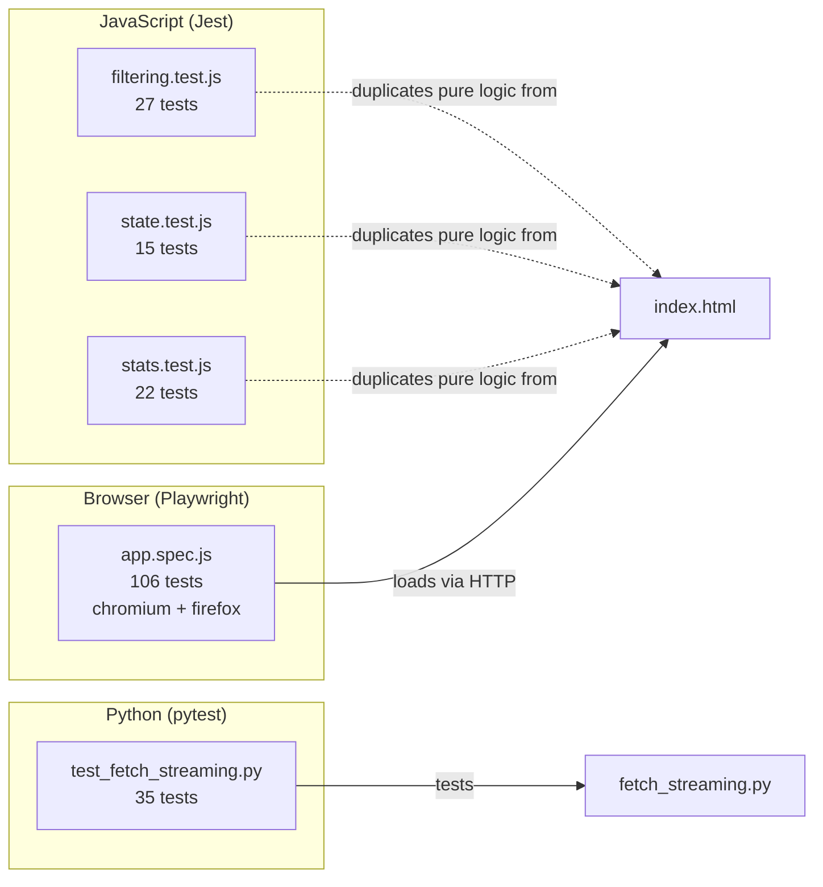

# Repository Workflow

Concise reference for how data flows through this project.

---

## System overview



---

## Data refresh flow



---

## App startup flow



---

## User interaction flow

```mermaid
stateDiagram-v2
    [*] --> Default: page load
    Default --> Filtered: apply service / status filter
    Filtered --> Default: clear filters
    Default --> Sorted: change sort (rank / title / year)
    Sorted --> Default: reset sort

    state CardActions {
        Unseen --> Seen: mark seen
        Seen --> Unseen: unmark
        Unmarked --> WantToWatch: mark want
        WantToWatch --> Unmarked: unmark
    }

    Default --> CardActions: interact with card
    CardActions --> localStorage: persist state
```

---

## Test structure



**Total: 205 tests**

---

## File ownership at a glance

| File | Purpose | Edit when |
|------|---------|-----------|
| `index.html` | Entire app | UI, logic, or style changes |
| `fetch_streaming.py` | API data fetcher | Adding movies, changing API params, schema changes |
| `streaming_data.json` | Cached streaming data | Re-run fetcher; do not hand-edit |
| `tests/unit/filtering.test.js` | Filter/sort logic tests | Filter or sort logic changes in index.html |
| `tests/unit/state.test.js` | State management tests | State or localStorage logic changes |
| `tests/unit/stats.test.js` | Stats calculation tests | Stats bar changes |
| `tests/integration/app.spec.js` | End-to-end tests | Any user-visible feature changes |
| `tests/python/test_fetch_streaming.py` | Fetcher unit tests | Changes to fetch_streaming.py |
